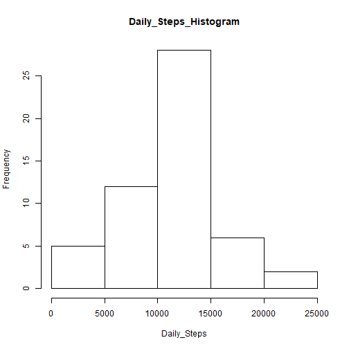
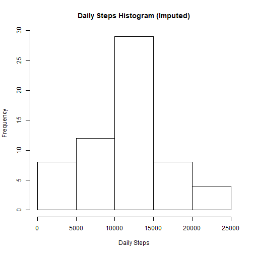
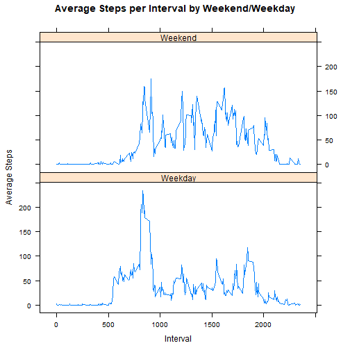

Peer-graded Assignment: Course Project 1
===========================================
Loading and preprocessing the data

Reading the activity .csv file:
  

```r
activity <- read.csv("activity.csv", header = TRUE)
```

Converting and the testing of the date format:

```r
activity$date <- format(as.Date(activity$date, "%m/%d/%Y"), "%Y-%m-%d")
str(activity$date)
```

```
##  chr [1:17568] "2012-10-01" "2012-10-01" "2012-10-01" "2012-10-01" ...
```

```r
activity$date <- as.Date(activity$date)
str(activity$date)
```

```
##  Date[1:17568], format: "2012-10-01" "2012-10-01" "2012-10-01" "2012-10-01" "2012-10-01" ...
```

What is mean total number of steps taken per day?

Creating dataframe of daily cumulative steps:

```r
activity_steps_day <- with(activity, aggregate(steps, by = list(date), sum))
colnames(activity_steps_day) <- c("date","steps")
```

Histogram of the daily cumulative steps:

```r
hist(activity_steps_day$steps,xlab="Daily_Steps",main="Daily_Steps_Histogram")
```



Computing the daily mean of the number of steps:

```r
mean(activity_steps_day$steps, na.rm = TRUE)
```

```
## [1] 10766.19
```

Computing the daily median of the number of steps

```r
median(activity_steps_day$steps, na.rm = TRUE)
```

```
## [1] 10765
```

Setting up average number of step per interval

```r
activity_steps_interval <- aggregate(steps ~ interval, activity, mean)
```

Line plot of average number of steps per 5 minute interval

```r
plot(activity_steps_interval$interval,
     activity_steps_interval$steps,
     type="l", 
     xlab="Time of Day", 
     ylab="Steps",
     main="Average Number of Steps")
```


Sorting using arrange to see the highest number of average steps:

```r
library(dplyr)
```

```
## 
## Attaching package: 'dplyr'
```

```
## The following objects are masked from 'package:stats':
## 
##     filter, lag
```

```
## The following objects are masked from 'package:base':
## 
##     intersect, setdiff, setequal, union
```

```r
arrange(activity_steps_interval, desc(activity_steps_interval$steps)) [1,]
```

```
##   interval    steps
## 1      835 206.1698
```
Double checking by getting max value:

```r
max(unlist(activity_steps_interval$steps), na.rm = TRUE)
```

```
## [1] 206.1698
```
The value matches the value from the first output.

Imputing missing values

Counting the number of NAs:

```r
length(activity$steps[is.na(activity$steps)])
```

```
## [1] 2304
```

```r
length(activity$date[is.na(activity$date)])
```

```
## [1] 0
```

```r
length(activity$interval[is.na(activity$interval)])
```

```
## [1] 0
```

Because there are not any NAs in the date and interval fields, the NA count from the steps field is enough.


Creating the imputed data dataframe:

```r
activity_impute <- activity
```

Merging the imputed dataframe and the earlier average activity step interval created earlier, thus using the average by interval.

```r
activty_merge <- merge(activity_impute, activity_steps_interval, by="interval")
```

Creating a list where steps are NA:

```r
activty_na_list <- which(is.na(activity_impute$steps))
```
Replacing the NAs with the average interval values:

```r
activity_impute[activty_na_list,"steps"] <- activty_merge[activty_na_list,"steps.y"]
```
Imputed data frame for graph and the graph:

```r
activity_imputed_steps_day<-with(activity_impute,aggregate(steps,by=list(date),sum))
colnames(activity_imputed_steps_day)<-c("date","steps")
hist(x=activity_imputed_steps_day$steps,xlab="Daily Steps",main="Daily Steps Histogram (Imputed)")
```


Mean of the steps with NAs removed:

```r
mean(activity_imputed_steps_day$steps)
```

```
## [1] 10889.8
```
Median of the steps with NAs removed:

```r
median(activity_imputed_steps_day$steps)
```

```
## [1] 11015
```
Setting up week dataframe:

```r
activity_week <- activity
```
Adding the day of week column:

```r
activity_week$day_of_week <- weekdays(activity$date)
```
Adding the weekday/weekend column:

```r
activity_week$weekday_weekend <- ifelse(activity_week$day_of_week %in% c("Saturday","Sunday"), "Weekend","Weekday")
```
Opening lattice package to enable the request graph:

```r
library(lattice)
```
Setting up the data for the graph:

```r
activity_week_data <- aggregate(steps ~ weekday_weekend + interval, activity_week, mean)
```

Plot of the data:

```r
xyplot(steps~interval|activity_week_data$weekday_weekend,
       data=activity_week_data,
       type="l",
       layout=c(1,2),
       main="Average Steps per Interval by Weekend/Weekday",
       xlab="Interval",
       ylab="Average Steps")
```


